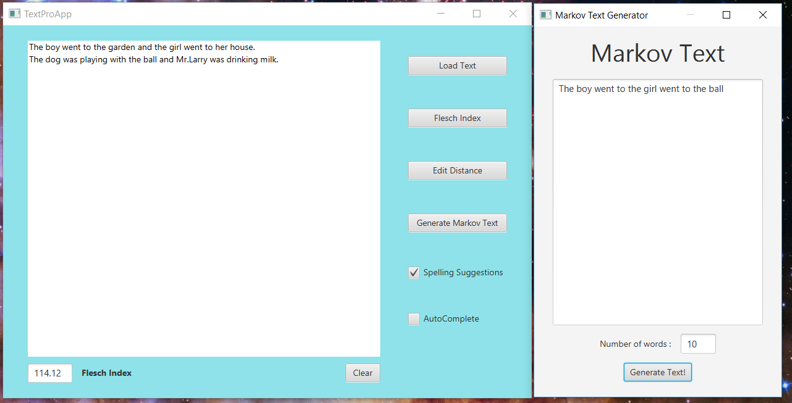

# Data Structures and performance

[Course Link](https://www.coursera.org/learn/data-structures-optimizing-performance)

About this Course:
>How do Java programs deal with vast quantities of data? Many of the data structures and algorithms that work with introductory toy examples break when applications process real, large data sets.  Efficiency is critical, but how do we achieve it, and how do we even measure it?
This is an intermediate Java course. We recommend this course to learners who have previous experience in software development or a background in computer science, and in particular, we recommend that you have taken the first course in this specialization (which also requires some previous experience with Java).  
In this course, you will use and analyze data structures that are used in industry-level applications, such as linked lists, trees, and hashtables.  You will explain how these data structures make programs more efficient and flexible.  You will apply asymptotic Big-O analysis to describe the performance of algorithms and evaluate which strategy to use for efficient data retrieval, addition of new data, deletion of elements, and/or memory usage.
The program you will build throughout this course allows its user to manage, manipulate and reason about large sets of textual data.  This is an intermediate Java course, and we will build on your prior knowledge.  This course is designed around  the same video series as in our first course in this specialization, including explanations of core content, learner videos, student and engineer testimonials, and support videos -- to better allow you to choose your own path through the course!

This course is provided by UCSD

1. After completing this course, you will be able to...
2. Describe the difference between an abstract data type (ADT) and its implementation.
3. Work with Java's built-in classes for fundamental data structures including: String, LinkedList, TreeSet, HashSet, and HashMap.
4. Implement fundamental data structures from scratch including Linked Lists and Tries (yes, we mean Tries rather than trees ... stay tuned to learn about this data structure!).
5. Analyze the performance of code, using Big-O notation as well as through benchmarking experiments.
6. Compare and contrast the performance of different data structures to select the most appropriate for a task.
7. Write JUnit tests to ensure the correctness of your code.
8. Implement several algorithms for generating and processing text.

## Project Overview

Computers can do amazing things with text these days. Spelling errors are practically a thing of the past, you barely type three characters and the computer seems to read your mind, knowing just what you are trying to type, and your computer can produce intelligible “speech”. How do all these technologies work? You’ll find out in this course, and in this project.

The project for this course is to build a smart text editor/processor that incorporates “intelligent” behaviors of modern-day text interfaces including autocomplete, flagging misspelled words and spelling auto-correct. In each module you’ll add a bit more functionality to your editor through the project associated with that module.

The code you’ll be developing here is what’s called “back-end” code, in that you’ll be working with the text, and not directly with any user interface components. This is so that you can really dig in and experiment with the different data structures you are learning and the running times for each of them. However, we provide you with a snazzy user interface (aka “front-end”) so that you can see the application of all of the functionality you implement. This division of behavior (front-end vs. back-end) is typical in intermediate and large-scale software design. However, if you feel inspired, you’re always welcome to play with the front-end code as well. Although we will not explicitly cover it in this course, we encourage you to seek external resources and play around if you are interested.

### Part 1 Implement the missing methods in BasicDocument.java
Implement getNumSentences, getNumWords and getNumSyllables following the comments about how they are supposed to work that you will find in your starter code (the version uploaded June 22, 2016 or later has the most detailed comments). You'll probably also want to implement countSyllables(String) in Document.java, to be called in getNumSyllables.

### Part 2: Implement the getFleschScore method in Document.java
Fill in the method getFleschScore() in Document.java to calculate the Flesch Score for the text in the document. You should use the following formula, and make calls to the getNumSyllables, getNumWords, and getNumSentences you just implemented.

### Part 3 : Markov Text Generation
The algorithm we will be implementing

set "starter" to be the first word in the text  
set "prevWord" to be starter
for each word "w" in the source text starting at the second word
   check to see if "prevWord" is already a node in the list
      if "prevWord" is a node in the list
         add "w" as a nextWord to the "prevWord" node
      else
         add a node to the list with "prevWord" as the node's word
         add "w" as a nextWord to the "prevWord" node
    set "prevWord" = "w"

add starter to be a next word for the last word in the source text.

### Part 4 : Spell Checking and Autocomplete
In this assignment you'll be adding the ability to flag misspelled words as well as perform auto-complete suggestions for the user's text as they type. This last part is particularly exciting when you get it working--your text editor will start to behave just like the editor on your phone!

### Part 5 : Spelling Suggestions
In this assignment, we'll implement the highly practical feature of giving someone suggestions for how to correct a misspelled word.

This project will consist of two parts.
The first is creating a class which allows us to do single operation mutations of words. For example, it will let us find the word "his" by removing a single letter from "this".

The second part will enable us to look through these "nearby" words to find spelling suggestions. So if you mistype and write "swone" it will suggest to you words like "stone".

### Learning outcomes:

1. Write code to manipulate text in Java
2. Use appropriate built-in data structures to implement functionality
3. Implement a specified Interface
4. Perform benchmarking to measure running time of code
5. Relate results of benchmarking tests to Big-O analysis
6. Write code to implement several core data structures
7. Write unit tests using JUnit to ensure the correctness of code
